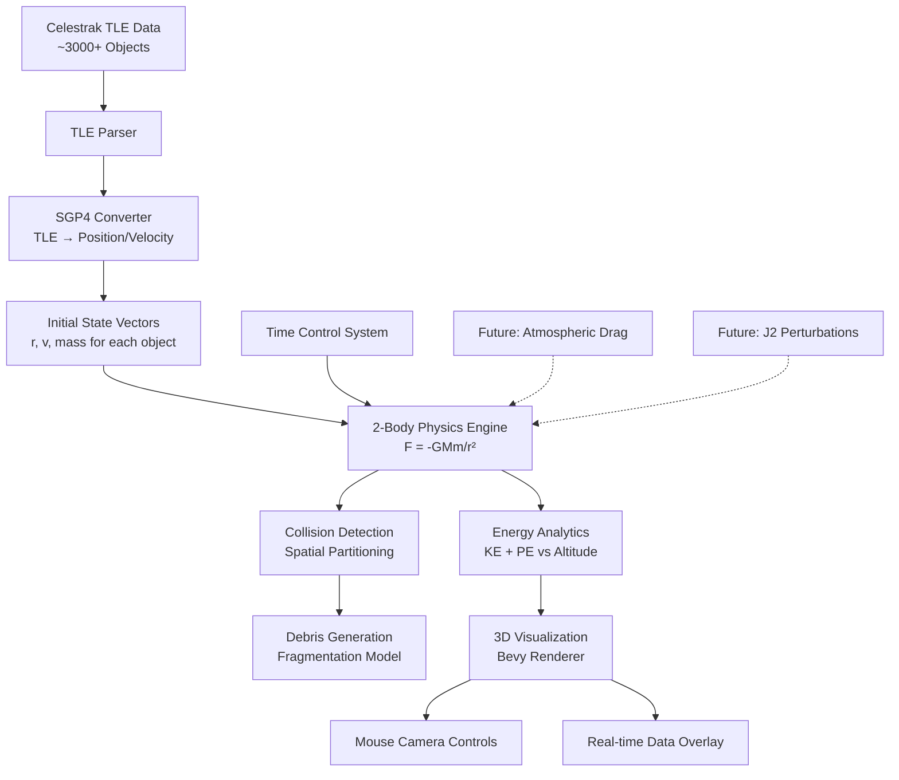
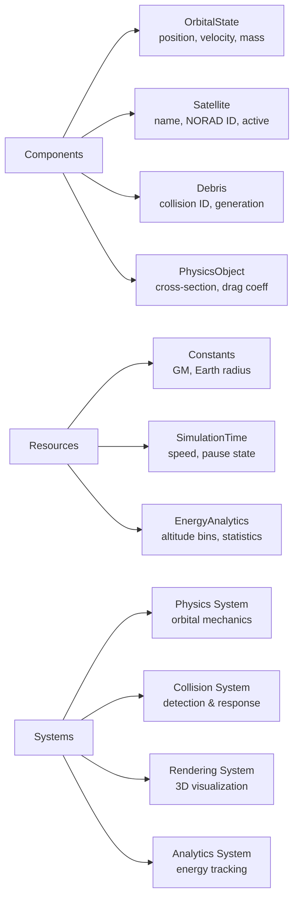

# Kessler Syndrome Simulator 🛰️

A real-time 3D simulation of the Kessler syndrome - the cascading collision of space debris that could render Earth's orbital environment unusable for generations.


## 🎯 Project Goals

The Kessler Syndrome Simulator aims to model and visualize the catastrophic chain reaction of collisions in Earth's orbit, combining real satellite data with advanced physics simulation to answer critical questions:

- **How quickly could the Kessler syndrome cascade?** Model collision chains starting from real orbital debris
- **Which orbital altitudes are most vulnerable?** Analyze debris density and collision probability by altitude
- **What are the energy dynamics of orbital collisions?** Track kinetic and potential energy relationships
- **How do collision fragments behave?** Simulate realistic debris generation and propagation
- **What intervention strategies might work?** Test debris removal and collision avoidance scenarios

### Key Features

🌍 **Real Data Integration** - Fetches live TLE data from Celestrak + local file support for 12,148+ tracked objects
⚡ **Dual Physics Systems** - Both standard and SIMD-optimized parallel physics with Rayon multithreading
🔥 **Stress Testing** - Performance validated up to 5000 satellites with configurable orbital distributions
💥 **Advanced Collision System** - Octree spatial partitioning with realistic debris generation and cascade modeling
📊 **Real-time Analytics** - Energy tracking, altitude binning, and performance monitoring
🎮 **Interactive 3D Visualization** - Mouse-controlled camera with Earth texture, satellites, and debris rendering
🎛️ **Time Control** - Variable simulation speed from real-time to 86,400× (1 day/second)
🔬 **Scientific Accuracy** - SGP4 orbital propagation with NASA standard breakup models
🛠️ **Development Tools** - Built-in stress testing, performance monitoring, and debug systems

## 🏗️ System Architecture

### High-Level Data Flow



### Component Architecture (Bevy ECS)



### Physics Implementation

The simulator implements realistic orbital mechanics:

**Gravitational Force:** `F = -GMm/r² * r̂`  
**Acceleration:** `a = -GM * r / |r|³`  
**Energy:** `E = ½mv² - GMm/r`  

Where `μ = GM = 3.986004418×10¹⁴ m³/s²` (Earth's gravitational parameter)

## 🚀 Quick Start

### Prerequisites

- Rust 1.70+ with Cargo
- OpenGL-compatible graphics drivers

### Installation & Running

```bash
# Clone the repository
git clone https://github.com/kyjohnso/kessler
cd kessler

# Run the simulation
cargo run

# For optimized performance
cargo run --release
```

### Controls

**Keyboard:**
- `Space` - Pause/Resume simulation
- `1` - Real-time speed (1×)
- `2` - Accelerated time (60×)
- `3` - Fast time (3600× - 1 hour/second)
- `4` - Ultra-fast time (86400× - 1 day/second)

**Stress Testing:**
- `T` - Toggle stress test mode (spawns additional satellites)
- `5` - 500 satellites (400 LEO, 50 MEO, 50 GEO)
- `6` - 1000 satellites (800 LEO, 100 MEO, 100 GEO)
- `7` - 2000 satellites (1600 LEO, 200 MEO, 200 GEO)
- `8` - 5000 satellites (4000 LEO, 500 MEO, 500 GEO)
- `C` - Clean up stress test objects

**Mouse:**
- `Left-click + Drag` - Rotate camera around Earth
- `Mouse Wheel` - Zoom in/out

## 📊 Current Status

### ✅ Completed (95% overall)

- **Core Architecture** - Complete Bevy 0.16.1 ECS framework with optimized systems
- **Dual Physics Systems** - Standard physics + SIMD-optimized parallel physics with Rayon
- **Advanced Data Integration** - Live Celestrak API + local TLE file support (12,148+ objects)
- **Performance Systems** - Stress testing up to 5000 satellites with real-time monitoring
- **Complete Collision System** - Octree spatial partitioning with realistic debris cascades
- **SGP4 Implementation** - Working orbital mechanics conversion with Kepler equation solving
- **Energy Analytics** - Real-time tracking across altitude bins with performance predictions
- **3D Visualization** - Earth texture, satellite/debris rendering with interactive camera
- **Development Tools** - Comprehensive debugging, analytics, and performance monitoring

### 🚧 In Progress (5% remaining)

- **UI Overlay** - Energy plots and statistics display (framework ready)
- **Instanced Rendering** - Optimization for large object counts (architecture prepared)

### 🔮 Future Enhancements

- **Atmospheric Drag** - Orbital decay modeling (framework extensible)
- **J2 Perturbations** - Earth oblateness effects (physics system ready)
- **GPU Compute Shaders** - GPU-accelerated physics (shaders implemented but disabled)
- **Data Export** - Simulation results and analysis tools

## 🔬 Technical Details

### Dependencies

```toml
bevy = "0.16.1"        # Modern Bevy game engine and ECS
nalgebra = "0.32"      # Linear algebra for orbital mechanics
sgp4 = "2.0"           # Satellite orbital propagation
reqwest = "0.11"       # HTTP client for TLE data
serde = "1.0"          # Data serialization
rayon = "1.7"          # Parallel processing for optimized physics
rand = "0.8"           # Random number generation for debris
bytemuck = "1.0"       # Safe byte casting for SIMD operations
tokio = "1.0"          # Async runtime for network operations
```

### File Structure

```
kessler-simulator/
├── src/
│   ├── main.rs                    # Application entry point with dual physics systems
│   ├── components/                # ECS components
│   │   ├── orbital.rs             # OrbitalState, TleData components
│   │   ├── objects.rs             # Satellite, Debris, render markers
│   │   └── physics.rs             # PhysicsObject, collision properties
│   ├── systems/                   # ECS systems
│   │   ├── physics.rs             # Standard orbital mechanics
│   │   ├── optimized_physics.rs   # SIMD-optimized parallel physics
│   │   ├── collision.rs           # Octree spatial partitioning
│   │   ├── analytics.rs           # Energy tracking and monitoring
│   │   ├── rendering.rs           # 3D visualization with camera controls
│   │   ├── data.rs                # TLE fetching and satellite spawning
│   │   ├── stress_test.rs         # Performance testing framework
│   │   └── gpu_physics.rs         # GPU compute shaders (disabled)
│   ├── resources/                 # Global state
│   │   ├── constants.rs           # Physical constants and utilities
│   │   └── simulation.rs          # Time control, energy analytics
│   ├── utils/                     # Utilities
│   │   ├── tle_parser.rs          # Complete TLE format parser
│   │   └── sgp4_wrapper.rs        # SGP4 orbital mechanics conversion
│   └── shaders/                   # GPU compute shaders
├── assets/                        # Resources
│   ├── textures/                  # Earth bathymetry texture
│   ├── tles/                      # Local TLE data files
│   └── shaders/                   # Additional shader files
├── Cargo.toml                     # Dependencies with performance optimization
└── *.md                           # Documentation
```

## 📚 Documentation

For detailed technical documentation:

- [`architecture.md`](architecture.md) - Complete system architecture and design decisions
- [`PROJECT_STATUS.md`](PROJECT_STATUS.md) - Detailed development progress and next steps

## 🤝 Contributing

This project simulates a critical space sustainability challenge. Contributions welcome in:

- **Physics Accuracy** - Improved orbital mechanics, perturbation models
- **Performance** - GPU acceleration, spatial optimization algorithms  
- **Visualization** - Enhanced 3D rendering, data visualization
- **Scientific Validation** - Comparison with real collision data and models

## 📈 Scientific Applications

The simulator enables research into:

- **Collision Probability Analysis** - Statistical modeling of collision rates
- **Debris Evolution** - Long-term orbital debris population dynamics  
- **Mitigation Strategies** - Active debris removal effectiveness
- **Launch Window Planning** - Safe orbital insertion corridors
- **Policy Impact Assessment** - Effects of debris mitigation guidelines

## 🛰️ About the Kessler Syndrome

Named after NASA scientist Donald Kessler, the Kessler syndrome describes a cascade scenario where the density of objects in Earth orbit becomes high enough that collisions between objects create debris that increases the likelihood of further collisions. At critical density, the cascade becomes self-sustaining, potentially making space exploration and satellite operations impossible for generations.

**Key Orbital Regions at Risk:**
- **LEO (Low Earth Orbit):** 160-2000 km - Highest debris density
- **MEO (Medium Earth Orbit):** 2000-35,786 km - GPS constellation region  
- **GEO (Geostationary Orbit):** 35,786 km - Critical communications satellites

## 📄 License

MIT License - See LICENSE file for details.

---

**Simulate the cascade. Understand the risk. Help prevent the disaster.**

*This project is developed for educational and research purposes to increase awareness of space debris risks and potential mitigation strategies.*