# Kessler Syndrome Simulator 🛰️

A real-time 3D simulation of the Kessler syndrome - the cascading collision of space debris that could render Earth's orbital environment unusable for generations.


## 🎯 Project Goals

The Kessler Syndrome Simulator aims to model and visualize the catastrophic chain reaction of collisions in Earth's orbit, combining real satellite data with advanced physics simulation to answer critical questions:

- **How quickly could the Kessler syndrome cascade?** Model collision chains starting from real orbital debris
- **Which orbital altitudes are most vulnerable?** Analyze debris density and collision probability by altitude
- **What are the energy dynamics of orbital collisions?** Track kinetic and potential energy relationships
- **How do collision fragments behave?** Simulate realistic debris generation and propagation
- **What intervention strategies might work?** Test debris removal and collision avoidance scenarios

### Key Features

🌍 **Real Data Integration** - Fetches live TLE data from Celestrak for 100+ real satellites
⚡ **Physics Simulation** - Complete 2-body orbital mechanics with collision detection and debris generation
📊 **Energy Analytics** - Real-time energy tracking vs altitude across all orbital regimes
🎮 **Interactive 3D Visualization** - Mouse-controlled camera with Earth, satellites, and debris cascades
🎛️ **Time Control** - Variable simulation speed from real-time to 24 hours/second
🔬 **Scientific Accuracy** - SGP4 orbital propagation with NASA breakup models for debris

## 🏗️ System Architecture

### High-Level Data Flow

```mermaid
graph TD
    A[Celestrak TLE Data<br/>~3000+ Objects] --> B[TLE Parser]
    B --> C[SGP4 Converter<br/>TLE → Position/Velocity]
    C --> D[Initial State Vectors<br/>r, v, mass for each object]
    
    D --> E[2-Body Physics Engine<br/>F = -GMm/r²]
    E --> F[Collision Detection<br/>Spatial Partitioning]
    F --> G[Debris Generation<br/>Fragmentation Model]
    
    E --> H[Energy Analytics<br/>KE + PE vs Altitude]
    H --> I[3D Visualization<br/>Bevy Renderer]
    
    I --> J[Mouse Camera Controls]
    I --> K[Real-time Data Overlay]
    
    L[Time Control System] --> E
    M[Future: Atmospheric Drag] -.-> E
    N[Future: J2 Perturbations] -.-> E
```



### Component Architecture (Bevy ECS)


### Physics Implementation

The simulator implements realistic orbital mechanics:

**Gravitational Force:** `F = -GMm/r² * r̂`  
**Acceleration:** `a = -GM * r / |r|³`  
**Energy:** `E = ½mv² - GMm/r`  

Where `μ = GM = 3.986004418×10¹⁴ m³/s²` (Earth's gravitational parameter)

## 🚀 Quick Start

### Prerequisites

- Rust 1.70+ with Cargo
- OpenGL-compatible graphics drivers

### Installation & Running

```bash
# Clone the repository
git clone https://github.com/yourusername/kessler-simulator
cd kessler-simulator

# Run the simulation
cargo run

# For optimized performance
cargo run --release
```

### Controls

**Keyboard:**
- `Space` - Pause/Resume simulation
- `1` - Real-time speed (1×)
- `2` - Accelerated time (60×)  
- `3` - Fast time (3600× - 1 hour/second)
- `4` - Ultra-fast time (86400× - 1 day/second)

**Mouse:**
- `Left-click + Drag` - Rotate camera around Earth
- `Mouse Wheel` - Zoom in/out

## 📊 Current Status

### ✅ Completed (90% overall)

- **Core Architecture** - Complete Bevy ECS framework with all systems
- **Physics Engine** - Full 2-body orbital mechanics with time control
- **3D Visualization** - Earth, satellites, debris rendering with camera controls
- **TLE Parsing** - Complete parser for Celestrak orbital element data
- **Live TLE Integration** - Real-time fetching of 100+ satellites from Celestrak API
- **SGP4 Implementation** - Complete TLE to state vector conversion
- **Collision Detection** - Octree spatial partitioning with sphere intersection testing
- **Debris Generation** - NASA standard breakup model with realistic fragmentation
- **Energy Analytics** - Real-time energy tracking across altitude bins (200km-2000km+)
- **Kessler Cascade** - Complete multi-generation debris collision modeling

### 🚧 In Progress

- **UI Overlay** - Energy plots and statistics display (planned for Phase 3)

### 🔮 Planned Features

- **Atmospheric Drag** - Orbital decay modeling
- **J2 Perturbations** - Earth oblateness effects
- **Control Panel** - Runtime parameter adjustment
- **Data Export** - Simulation results for analysis
- **Performance Optimization** - GPU acceleration for large debris clouds

## 🔬 Technical Details

### Dependencies

```toml
bevy = "0.12"          # Game engine and ECS
nalgebra = "0.32"      # Linear algebra for orbital mechanics  
sgp4 = "2.0"           # Satellite orbital propagation
reqwest = "0.11"       # HTTP client for TLE data
serde = "1.0"          # Data serialization
```

### File Structure

```
kessler-simulator/
├── src/
│   ├── main.rs                 # Application entry point
│   ├── components/             # ECS components
│   │   ├── orbital.rs          # Position, velocity, TLE data
│   │   ├── objects.rs          # Satellite and debris types  
│   │   └── physics.rs          # Mass, cross-section, collision
│   ├── systems/                # ECS systems
│   │   ├── physics.rs          # Orbital mechanics
│   │   ├── collision.rs        # Collision detection
│   │   ├── analytics.rs        # Energy tracking
│   │   ├── rendering.rs        # 3D visualization
│   │   └── data.rs             # TLE fetching
│   ├── resources/              # Global state
│   │   ├── constants.rs        # Physical constants
│   │   └── simulation.rs       # Time control, analytics
│   └── utils/                  # Utilities
│       ├── tle_parser.rs       # TLE format parsing
│       └── sgp4_wrapper.rs     # Orbital propagation
├── assets/                     # 3D models, textures
├── Cargo.toml
└── README.md
```

## 📚 Documentation

For detailed technical documentation:

- [`architecture.md`](architecture.md) - Complete system architecture and design decisions
- [`PROJECT_STATUS.md`](PROJECT_STATUS.md) - Detailed development progress and next steps

## 🤝 Contributing

This project simulates a critical space sustainability challenge. Contributions welcome in:

- **Physics Accuracy** - Improved orbital mechanics, perturbation models
- **Performance** - GPU acceleration, spatial optimization algorithms  
- **Visualization** - Enhanced 3D rendering, data visualization
- **Scientific Validation** - Comparison with real collision data and models

## 📈 Scientific Applications

The simulator enables research into:

- **Collision Probability Analysis** - Statistical modeling of collision rates
- **Debris Evolution** - Long-term orbital debris population dynamics  
- **Mitigation Strategies** - Active debris removal effectiveness
- **Launch Window Planning** - Safe orbital insertion corridors
- **Policy Impact Assessment** - Effects of debris mitigation guidelines

## 🛰️ About the Kessler Syndrome

Named after NASA scientist Donald Kessler, the Kessler syndrome describes a cascade scenario where the density of objects in Earth orbit becomes high enough that collisions between objects create debris that increases the likelihood of further collisions. At critical density, the cascade becomes self-sustaining, potentially making space exploration and satellite operations impossible for generations.

**Key Orbital Regions at Risk:**
- **LEO (Low Earth Orbit):** 160-2000 km - Highest debris density
- **MEO (Medium Earth Orbit):** 2000-35,786 km - GPS constellation region  
- **GEO (Geostationary Orbit):** 35,786 km - Critical communications satellites

## 📄 License

MIT License - See LICENSE file for details.

---

**Simulate the cascade. Understand the risk. Help prevent the disaster.**

*This project is developed for educational and research purposes to increase awareness of space debris risks and potential mitigation strategies.*