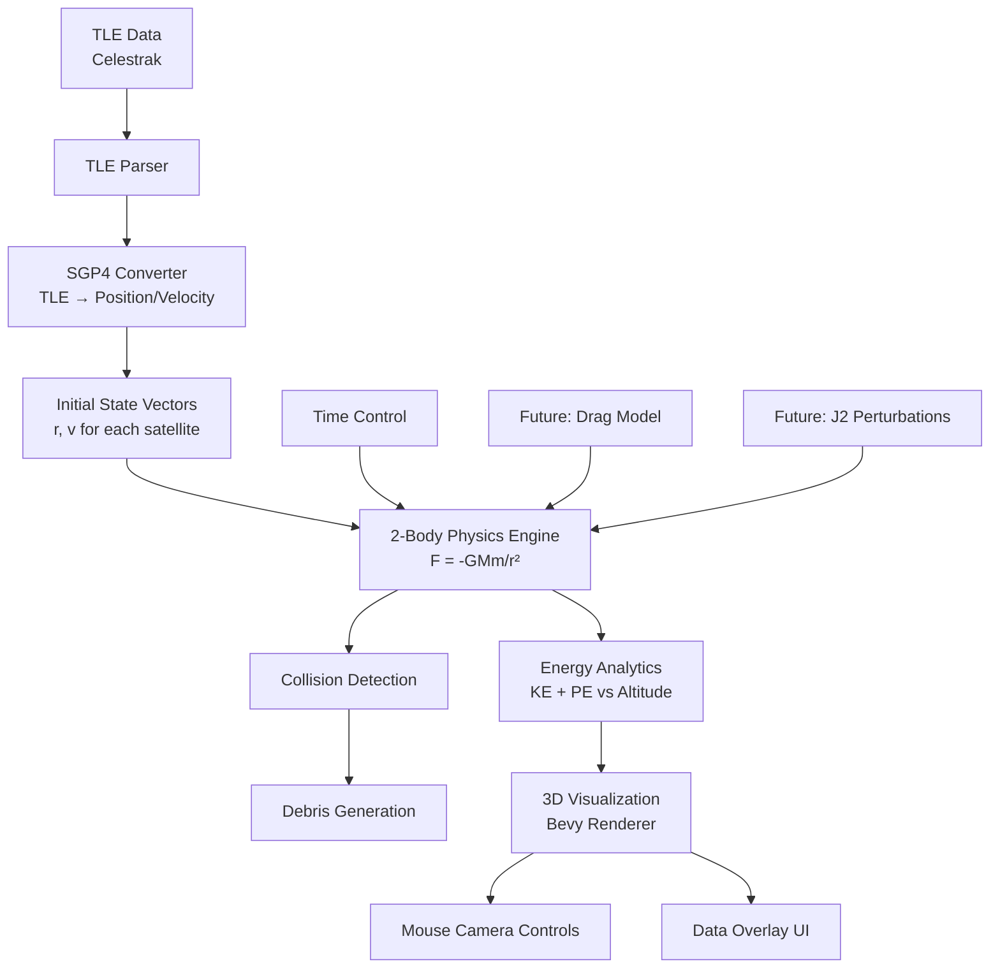

# Kessler Syndrome Simulator Architecture

## Project Overview

A Bevy-based simulator for the Kessler syndrome that combines real satellite orbital data with physics simulation, collision modeling, and data analytics. The simulator uses real TLE (Two-Line Element) data from Celestrak for initial conditions, then propagates orbits using 2-body physics with future extensibility for perturbations.

## Key Features

- **Real Data Integration**: Fetch TLE data from Celestrak for all trackable objects
- **Physics Simulation**: 2-body orbital mechanics with collision detection
- **Debris Generation**: Model cascading collision events (Kessler syndrome)
- **Analytics**: Track energy vs altitude relationships across all objects
- **3D Visualization**: Interactive 3D scene with Earth, satellites, and debris
- **Mouse Controls**: Rotate and zoom camera around the scene
- **Future Features**: Atmospheric drag, J2 perturbations, control panel UI

## System Architecture



## Data Flow

### Initialization Phase
1. **TLE Fetching**: Download current TLE data from Celestrak API
2. **TLE Parsing**: Parse two-line element format into structured data
3. **SGP4 Conversion**: Convert TLE data to position/velocity state vectors
4. **Object Creation**: Spawn Bevy entities with orbital components

### Simulation Loop
1. **Physics Step**: Apply 2-body gravitational forces: `a = -GM * r / |r|³`
2. **Integration**: Update positions and velocities using numerical integration
3. **Collision Detection**: Check for object intersections
4. **Debris Generation**: Create new debris objects from collisions
5. **Analytics Update**: Calculate energies and altitude statistics
6. **Rendering**: Update 3D scene and UI overlays

## Core Components (Bevy ECS)

### Components
```rust
// Core orbital state
struct OrbitalState {
    position: Vec3,    // Position vector (km)
    velocity: Vec3,    // Velocity vector (km/s)
    mass: f64,         // Object mass (kg)
}

// Object classification
struct Satellite {
    name: String,
    norad_id: u32,
    active: bool,
}

struct Debris {
    parent_collision: Option<u32>,  // Collision event ID
    generation: u32,                // Debris generation number
}

// Physics properties
struct PhysicsObject {
    cross_section: f64,  // For drag calculations (m²)
    drag_coefficient: f64,
}
```

### Resources
```rust
// Global simulation state
struct SimulationTime {
    current: f64,      // Simulation time (seconds since epoch)
    speed_multiplier: f64,
    paused: bool,
}

// Analytics tracking
struct EnergyAnalytics {
    altitude_bins: Vec<f64>,
    energy_by_altitude: HashMap<usize, Vec<f64>>,
    total_objects: usize,
    total_debris: usize,
}

// Physical constants
struct Constants {
    earth_mass: f64,           // 5.972e24 kg
    gravitational_parameter: f64,  // GM = 3.986004418e14 m³/s²
    earth_radius: f64,         // 6.371e6 m
}
```

### Systems

#### Core Systems
- `fetch_tle_data_system`: HTTP client for Celestrak data
- `sgp4_initialization_system`: Convert TLEs to initial conditions
- `physics_system`: 2-body orbital mechanics
- `collision_detection_system`: Spatial partitioning and intersection tests
- `debris_generation_system`: Create debris from collisions
- `energy_analytics_system`: Calculate and bin energy statistics

#### Rendering Systems  
- `satellite_rendering_system`: Visualize satellites as 3D objects/points
- `debris_rendering_system`: Render debris cloud
- `earth_rendering_system`: Earth sphere with texture
- `camera_control_system`: Mouse-based camera rotation/zoom
- `ui_overlay_system`: Energy plots and statistics display

#### Future Systems
- `atmospheric_drag_system`: Atmospheric perturbations
- `j2_perturbation_system`: Earth oblateness effects  
- `reentry_tracking_system`: Object decay and removal
- `control_panel_system`: UI for simulation parameters

## Technical Stack

### Dependencies
```toml
[dependencies]
bevy = "0.12"
reqwest = { version = "0.11", features = ["json"] }
tokio = { version = "1.0", features = ["rt-multi-thread"] }
serde = { version = "1.0", features = ["derive"] }
serde_json = "1.0"
nalgebra = "0.32"  # Linear algebra for orbital mechanics
sgp4 = "2.0"       # SGP4 orbital propagation
```

### External APIs
- **Celestrak**: TLE data source (https://celestrak.org/)
  - All active satellites
  - Debris catalog
  - No registration required

## Physics Implementation

### 2-Body Problem
The fundamental gravitational force equation:
```
F = -GMm/r² * r̂
a = -GM/r² * r̂ = -μ/r² * r̂
```

Where:
- `μ = GM = 3.986004418e14 m³/s²` (Earth's gravitational parameter)
- `r` is position vector magnitude
- `r̂` is unit position vector

### Numerical Integration
Initial implementation will use simple Euler integration:
```
v(t+dt) = v(t) + a(t) * dt
r(t+dt) = r(t) + v(t) * dt
```

Future optimization: Runge-Kutta 4th order or symplectic integrators

### Energy Calculations
```
Kinetic Energy: KE = ½mv²
Potential Energy: PE = -GMm/r
Total Energy: E = KE + PE
```

## Performance Considerations

### Initial Approach
- Render all objects as simple points or low-poly meshes
- Basic collision detection with broad-phase spatial partitioning
- Energy calculations every N frames to reduce overhead

### Optimization Strategies (Future)
- Level-of-detail (LOD) rendering based on distance
- Octree spatial partitioning for collision detection
- GPU-based physics computation for large debris clouds
- Instanced rendering for similar objects

## Development Phases

### Phase 1: Core Framework
- Basic Bevy setup with 3D scene
- TLE parsing and SGP4 conversion
- Simple 2-body physics
- Basic visualization

### Phase 2: Collision System
- Collision detection
- Debris generation
- Energy analytics
- Mouse camera controls

### Phase 3: Advanced Features
- Atmospheric drag perturbations
- J2 oblateness effects
- Re-entry tracking
- Control panel UI

### Phase 4: Optimization
- Performance improvements
- Large-scale simulations
- Data export functionality
- Advanced visualization

## File Structure

```
kessler-simulator/
├── Cargo.toml
├── src/
│   ├── main.rs
│   ├── components/
│   │   ├── mod.rs
│   │   ├── orbital.rs
│   │   ├── objects.rs
│   │   └── physics.rs
│   ├── systems/
│   │   ├── mod.rs
│   │   ├── data.rs
│   │   ├── physics.rs
│   │   ├── collision.rs
│   │   ├── analytics.rs
│   │   └── rendering.rs
│   ├── resources/
│   │   ├── mod.rs
│   │   ├── constants.rs
│   │   └── simulation.rs
│   └── utils/
│       ├── mod.rs
│       ├── tle_parser.rs
│       └── sgp4_wrapper.rs
├── assets/
│   └── earth_texture.jpg
└── README.md
```

This architecture provides a solid foundation for building the Kessler syndrome simulator with clear separation of concerns, extensibility for future features, and performance considerations built in from the start.